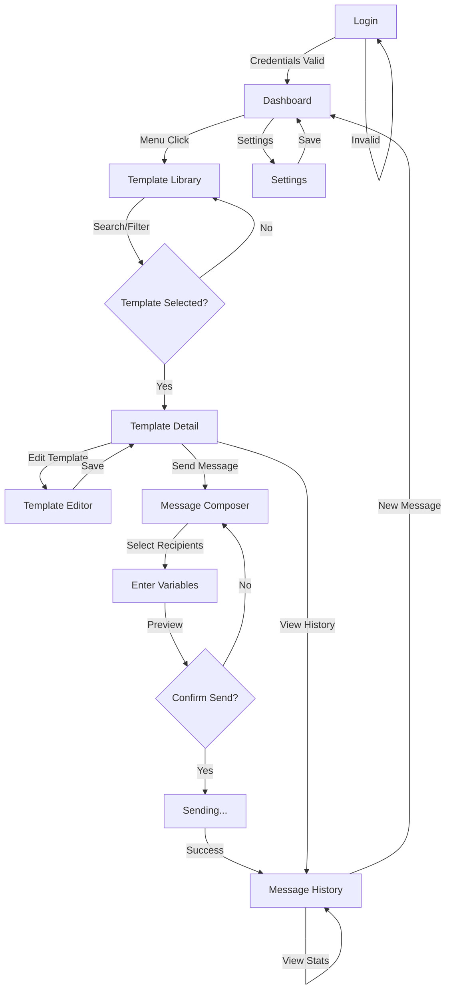

# Front-End Specification
## Cartão de Todos - Meta WhatsApp Business API Platform

**Document Version:** 1.0
**Date:** 2026-03-11
**Status:** Ready for Development
**Designer:** Uma (UX/UI Expert Agent)

---

## 1. Design Tokens

### 1.1 Color Palette

#### Primary Colors
```
Primary Brand:      #00A988 (Cartão de Todos Green)
Primary Hover:      #008B7A (Darker shade for interactions)
Primary Light:      #E6F5F1 (Very light background tint)
Primary Focus:      #006B5C (Darkest shade for focus states)
```

#### Semantic Colors
```
Success:            #10B981 (Emerald green for approvals)
Error:              #EF4444 (Red for errors, rejections)
Warning:            #F59E0B (Amber for warnings, pending states)
Info:               #3B82F6 (Blue for information)
Neutral:            #6B7280 (Gray for secondary content)
```

#### Status Colors (Template States)
```
Approved:           #00A988 (Primary green)
Pending:            #F59E0B (Amber yellow)
Rejected:           #EF4444 (Red)
Paused:             #F97316 (Deep orange)
Disabled:           #D1D5DB (Light gray)
```

#### Neutral Palette
```
White:              #FFFFFF
Background:         #F9FAFB (Very light gray)
Surface:            #FFFFFF
Border Light:       #E5E7EB (Light gray)
Border Dark:        #D1D5DB (Medium gray)
Text Primary:       #111827 (Near black)
Text Secondary:     #6B7280 (Medium gray)
Text Disabled:      #9CA3AF (Light gray)
```

### 1.2 Typography

#### Font Family
```
Primary Font:       Inter, -apple-system, BlinkMacSystemFont, "Segoe UI", sans-serif
Fallback:           System stack for cross-platform consistency
Recommended Web:    Inter (Google Fonts) for optimal pt-BR diacritic support
```

#### Font Sizes (Scale)
```
Display:            32px / 2rem (Bold, page titles, major headings)
Large:              24px / 1.5rem (Card titles, section headings)
Heading:            20px / 1.25rem (Subsection headings, dialog titles)
Body:               16px / 1rem (Primary body text, form inputs)
Small:              14px / 0.875rem (Secondary text, helper text, labels)
```

#### Font Weight
```
Regular:            400 (Body text, default)
Medium:             500 (Labels, emphasis)
Semibold:           600 (Headings, strong emphasis)
Bold:               700 (Display, very strong emphasis)
```

#### Line Heights
```
Display:            1.2 (Tight, large text)
Heading:            1.4 (Comfortable for headings)
Body:               1.6 (Loose, readable body text, accommodates pt-BR length)
Small:              1.4 (Compact secondary text)
```

### 1.3 Spacing Scale

#### Base Unit: 8px
```
0:      0px
1:      8px   (xs) - Tight spacing
2:      16px  (sm) - Small spacing
3:      24px  (md) - Medium spacing (default component gap)
4:      32px  (lg) - Large spacing
6:      48px  (xl) - Extra-large spacing
```

#### Common Combinations
```
Padding:
  - Buttons:        px-4 py-2 (16px x 8px)
  - Cards:          p-4 (16px all sides)
  - Sections:       p-6 (24px) or p-8 (32px)

Gaps:
  - Component gap:  8px (between icons and text)
  - Section gap:    24px (between major components)
  - Page gap:       32px (between sections)

Margin:
  - Component:      mb-2 (8px bottom)
  - Section:        mb-6 (24px bottom)
  - Page:           mb-8 (32px bottom)
```

### 1.4 Elevation & Shadows

#### Shadow Levels
```
Elevation 1 (Default Card):
  box-shadow: 0 1px 2px 0 rgba(0, 0, 0, 0.05)
  Usage: Cards, dropdowns, basic surfaces

Elevation 2 (Interactive):
  box-shadow: 0 4px 6px -1px rgba(0, 0, 0, 0.1), 0 2px 4px -1px rgba(0, 0, 0, 0.06)
  Usage: Modals, popovers, elevated buttons on hover

Elevation 3 (Modal/Dialog):
  box-shadow: 0 20px 25px -5px rgba(0, 0, 0, 0.1), 0 10px 10px -5px rgba(0, 0, 0, 0.04)
  Usage: Dialogs, large modals, top-level navigation
```

#### Border Radius
```
None:       0px
Small:      4px (Input fields, badges)
Medium:     8px (Cards, buttons)
Large:      12px (Dialogs, full-width components)
Full:       9999px (Pills, avatars, fully rounded)
```

---

## 2. Component Library

### 2.1 Atomic Components (Foundational)

#### Button
- **Variants:** Primary, Secondary, Danger, Ghost
- **Sizes:** Small (32px), Medium (40px), Large (48px)
- **States:** Default, Hover, Active, Disabled, Loading
- **Props:** Icon, Label, Type (Button/Submit), Disabled

#### Input
- **Types:** Text, Email, Password, Number, Search, Textarea
- **States:** Default, Focused, Error, Disabled, Success
- **Features:** Placeholder, Helper text, Icon (left/right), Validation
- **Accessibility:** Label linked via id, Aria-describedby for errors

#### Label
- **For Form Fields:** Associated with input via htmlFor
- **Variants:** Regular, Required (with red asterisk), Secondary
- **Font:** 14px, Medium weight, color: #111827

#### Icon
- **Source:** Heroicons or Feather Icons (24px base)
- **Colors:** Inherit from parent, override with color prop
- **Sizes:** 16px, 20px, 24px, 32px
- **Props:** Name, Size, Color, Stroke width

#### Badge
- **Variants:** Status (Approved/Pending/Rejected/Paused/Disabled)
- **Sizes:** Small, Medium
- **Format:** Compact text + color coding
- **Props:** Variant, Label, Icon (optional)

#### Checkbox
- **States:** Unchecked, Checked, Indeterminate, Disabled
- **Size:** 20px × 20px
- **Color:** Primary green (#00A988) when checked
- **Accessibility:** Native input with label association

#### Select/Dropdown
- **Features:** Searchable, Multi-select variant
- **Appearance:** Clean, minimal style
- **Behavior:** Keyboard navigation, accessibility compliant

### 2.2 Molecular Components (Composed)

#### FormField
- **Composition:** Label + Input + Helper text + Error message
- **Props:** Label, Name, Type, Required, Error, HelperText
- **Spacing:** Label 8px above input, error 4px below
- **Validation:** Real-time feedback, clear error messaging

#### Card
- **Structure:** Header (optional) + Content + Footer (optional)
- **Padding:** 16px default, 24px for larger cards
- **Shadow:** Elevation 1 (default)
- **Hover:** Subtle shadow increase on interactive cards
- **Props:** Title, Children, Footer, Interactive, Selected

#### SearchBar
- **Composition:** Input (search icon) + Clear button
- **Features:** Autocomplete results dropdown
- **Debounce:** 300ms input delay to prevent excessive API calls
- **Props:** Placeholder, OnSearch, Results, Loading state

#### StatusBadge
- **Composition:** Icon + Label + Color
- **States:** Approved (✅ green), Pending (⏳ amber), Rejected (❌ red), Paused (⏸️ orange), Disabled (🚫 gray)
- **Props:** Status, Compact mode

#### Pagination
- **Features:** Previous/Next buttons, page numbers, jump to page
- **States:** Disabled when at first/last page
- **Mobile:** Compact on mobile (prev/next only)

### 2.3 Organismic Components (Complex Sections)

#### Header/Navigation Bar
- **Height:** 64px desktop, 56px mobile
- **Content:** Logo (left), Navigation (center), User menu (right)
- **Sticky:** Position: sticky, z-index for overlays
- **Responsive:** Hamburger menu on mobile, full nav on desktop
- **Features:** Active route highlighting, user dropdown menu

#### Sidebar Navigation
- **Width:** 280px desktop, collapsible to 80px
- **Mobile:** Hidden by default, slide-out drawer
- **Content:** Logo, menu items with icons, section headers
- **Active State:** Highlight current route with primary color background
- **Scroll:** Independent scrolling for long menu lists

#### DataTable
- **Features:** Sortable columns, selectable rows, pagination
- **Columns:** Resizable, minimum width enforcement
- **States:** Loading, empty, error states
- **Mobile:** Horizontally scrollable with sticky first column
- **Row Actions:** Quick actions menu (⋯), bulk actions toolbar

#### TemplateCard (Custom Organism)
- **Composition:** Status badge + Icon/Thumbnail + Content + Quality rating + Actions
- **Content:** Template name, category, language, preview text, usage count
- **Footer:** Send/Edit/Duplicate buttons
- **States:** Default, Hover (shadow increase), Selected (highlight border)

#### Modal/Dialog
- **Features:** Dismissible, action buttons (Primary/Secondary/Cancel)
- **Focus Management:** Focus trap, auto-focus to first input
- **Overlay:** Semi-transparent dark backdrop (rgba(0,0,0,0.5))
- **Keyboard:** Escape to close, Tab navigation
- **Animation:** Smooth fade-in/slide-up on open

#### Toast Notifications
- **Position:** Bottom-right corner (or top-right on mobile)
- **Duration:** 3-5 seconds auto-dismiss for info/success, persistent for errors
- **Types:** Success (green), Error (red), Warning (amber), Info (blue)
- **Stack:** Multiple toasts stack vertically

---

## 3. Priority Screens

### 3.1 Login Screen

**URL:** `/login`
**Access:** Public (no authentication required)
**Size:** Single-column centered layout

#### Layout Structure
```
┌─────────────────────────────┐
│                             │
│      Cartão de Todos        │  (Logo + brand name)
│    WhatsApp Admin           │  (Subheading)
│                             │
│    ┌───────────────────┐    │
│    │                   │    │  (Form Card)
│    │  Email Field      │    │
│    │  Password Field   │    │
│    │  [Login Button]   │    │
│    │                   │    │
│    │  Forgot Password? │    │
│    │                   │    │
│    └───────────────────┘    │
│                             │
│   © 2026 Cartão de Todos    │  (Footer text)
│                             │
└─────────────────────────────┘
```

#### Key Components
- **Logo:** 64px height, centered top
- **Form Card:** White background, shadow elevation 2, 400px max-width
- **FormFields:** Email + Password, full-width
- **Login Button:** Primary color, full-width, 48px height
- **Remember Me:** Checkbox + label (optional for MVP)
- **Forgot Password:** Link (future feature)
- **Error Messages:** Red text, displayed above button
- **Loading State:** Button shows spinner + "Entrando..."

#### Responsive Design
- **Mobile:** 320-767px - Full width with padding, no max-width constraint
- **Desktop:** 1024px+ - Centered card with fixed width

#### Accessibility
- Form has proper labels and semantic HTML
- Error messages linked to inputs via aria-describedby
- Keyboard navigation (Tab through fields, Enter submits)
- Color not sole indicator of error state

---

### 3.2 Dashboard Screen

**URL:** `/dashboard`
**Access:** Authenticated users only
**Purpose:** Overview of key metrics and recent activity

#### Layout Structure
```
┌─────────────────────────────────────────────────────┐
│ Header with user name, logout, help              │
├─────────────────────────────────────────────────────┤
│ Sidebar Navigation (left)                         │
├──────────────────┬──────────────────────────────────┤
│                  │                                  │
│                  │  Quick Stats (4 cards)           │
│                  │  ┌──────┐ ┌──────┐              │
│                  │  │ 42   │ │ 156  │              │
│                  │  │ Tpls │ │ Sent │              │
│                  │  └──────┘ └──────┘              │
│                  │  ┌──────┐ ┌──────┐              │
│                  │  │ 3    │ │ 98%  │              │
│                  │  │Pend. │ │Deliv.│              │
│                  │  └──────┘ └──────┘              │
│                  │                                  │
│  Navigation      │  Recent Activity Feed            │
│                  │  ┌──────────────────────┐        │
│                  │  │ Template created     │        │
│                  │  │ "Promo 20%" 2 hrs    │        │
│                  │  ├──────────────────────┤        │
│                  │  │ Message sent         │        │
│                  │  │ 150 recipients       │        │
│                  │  │ "Welcome" 4 hrs      │        │
│                  │  ├──────────────────────┤        │
│                  │  │ Template rejected    │        │
│                  │  │ "Test Promo" 6 hrs   │        │
│                  │  └──────────────────────┘        │
│                  │                                  │
│                  │  Quick Actions:                  │
│                  │  [+ New Template]               │
│                  │  [📧 Send Message]               │
│                  │                                  │
└──────────────────┴──────────────────────────────────┘
```

#### Key Components
- **Header:** Logo + greeting "Bem-vindo, [Name]!" + User dropdown + Logout
- **Sidebar:** Active indicator on Dashboard, navigation links
- **Stat Cards:** 4 metrics in 2×2 grid (templates, sent, pending, delivery rate)
  - Card format: Large number + label + trend indicator (↑/↓)
  - Colors: Neutral background, colored accent bar on left
- **Recent Activity:** List of last 5 events with timestamp and icon
- **Quick Actions:** Two prominent buttons for main tasks

#### Responsive Design
- **Mobile:** Single column, sidebar as drawer, stat cards in 1 column
- **Tablet:** Single column content, sidebar visible
- **Desktop:** 2-column layout as shown

#### Data & API
- **Stats fetch:** GET `/api/dashboard/stats` (templates count, sent today, pending, delivery rate)
- **Activity fetch:** GET `/api/dashboard/activity` (last 5 events)
- **Polling:** Refresh stats every 30 seconds for real-time updates

---

### 3.3 Template Library Screen

**URL:** `/templates`
**Access:** All authenticated users
**Purpose:** Browse and search all WhatsApp templates

#### Layout Structure
```
┌────────────────────────────────────────────────────┐
│ [Header]                                          │
├──────────────────┬────────────────────────────────┤
│  [Sidebar]       │  Search + Filters              │
│                  │  ┌──────────────────────┐      │
│                  │  │ 🔍 Pesquisar...      │      │
│                  │  └──────────────────────┘      │
│                  │  Filtros:                      │
│                  │  ⬜ Aprovado (12)              │
│                  │  ⬜ Pendente (3)               │
│                  │  ⬜ Rejeitado (1)              │
│                  │  ⬜ Parado (0)                 │
│                  │  ⬜ Desativado (1)             │
│                  │                                │
│                  │  Categoria:                    │
│                  │  ⬜ Marketing (8)              │
│                  │  ⬜ Utilidade (5)              │
│                  │  ⬜ Autenticação (3)           │
│                  │                                │
│                  │  Template Grid:                │
│                  │  ┌────────────┬────────────┐   │
│                  │  │ [Card 1]   │ [Card 2]   │   │
│                  │  ├────────────┼────────────┤   │
│                  │  │ [Card 3]   │ [Card 4]   │   │
│                  │  ├────────────┼────────────┤   │
│                  │  │ [Card 5]   │ [Card 6]   │   │
│                  │  └────────────┴────────────┘   │
│                  │  [← Previous] [1] [2] [Next →] │
│                  │                                │
└──────────────────┴────────────────────────────────┘
```

#### Key Components
- **SearchBar:** Full-width search input with debounce, real-time results
- **Filters:** Status (checkboxes) and Category (radio buttons)
- **Template Cards:** See section 2.3 (TemplateCard component)
- **Grid Layout:** 2-3 columns (responsive)
- **Pagination:** 12 items per page, previous/next + page numbers
- **Empty State:** Message + illustration if no templates match filters
- **View Toggle:** Grid/List view switcher (optional)

#### Responsive Design
- **Mobile:** Single column cards, filters in collapsible drawer
- **Tablet:** 2-column grid, filters visible
- **Desktop:** 3-column grid, sidebar filters

#### Data & API
- **Templates fetch:** GET `/api/templates?page=1&status=approved&category=marketing&search=query`
- **Search debounce:** 300ms delay to prevent excessive API calls
- **Pagination:** 12 items per page
- **Filters:** Status, Category, Language (future)

#### User Actions
- **Click Card:** Navigate to Template Detail (3.4)
- **Send:** Modal to select recipients
- **Edit:** Navigate to Template Editor
- **Duplicate:** Create copy, prefixed with "Copy of"
- **More Actions:** Delete, Archive (future)

---

### 3.4 Template Detail Screen

**URL:** `/templates/[templateId]`
**Access:** All authenticated users
**Purpose:** View template content, preview, and take actions

#### Layout Structure
```
┌────────────────────────────────────────────────────┐
│ [Header with breadcrumb: Dashboard > Templates > X]│
├──────────────────┬────────────────────────────────┤
│  [Sidebar]       │  Template Detail               │
│                  │                                │
│                  │  ┌─────────────────────────┐   │
│                  │  │ [✅ APPROVED]           │   │
│                  │  │ Promotional - Discount  │   │
│                  │  │ Template Name           │   │
│                  │  │ pt-BR • Marketing       │   │
│                  │  └─────────────────────────┘   │
│                  │                                │
│                  │  Quality Score:                │
│                  │  ★★★★☆ High (94%)             │
│                  │                                │
│                  │  Template Preview:             │
│                  │  ┌─ Phone Mockup ─────┐       │
│                  │  │ Cartão de Todos    │       │
│                  │  │ ┌────────────────┐ │       │
│                  │  │ │   [IMAGE]      │ │       │
│                  │  │ └────────────────┘ │       │
│                  │  │                    │       │
│                  │  │ Olá João,          │       │
│                  │  │ aproveite 20%      │       │
│                  │  │ de desconto!       │       │
│                  │  │                    │       │
│                  │  │ Cartão de Todos    │       │
│                  │  │ Responda PARAR...  │       │
│                  │  │                    │       │
│                  │  │ [Ver ofertas]      │       │
│                  │  └────────────────────┘       │
│                  │                                │
│                  │  Template Code View:           │
│                  │  Name: promotional_discount   │
│                  │  Language: pt_BR              │
│                  │  Category: MARKETING          │
│                  │  ...                          │
│                  │                                │
│                  │  [🔄 Edit] [📧 Send] [+Copy]  │
│                  │                                │
│                  │  Usage Stats:                  │
│                  │  Sent: 1,234 • Read: 456      │
│                  │  Created: 10/02/2026          │
│                  │                                │
└──────────────────┴────────────────────────────────┘
```

#### Key Components
- **Status Badge:** Large, color-coded (Approved/Pending/Rejected/Paused/Disabled)
- **Title & Meta:** Template name, category, language, creation date
- **Quality Rating:** Star rating + percentage score with explanation
- **Preview Panel:** Mobile mockup showing how message appears in WhatsApp
- **Code View:** Collapsible section showing template JSON/configuration
- **Action Buttons:** Edit, Send, Duplicate (permissions-based)
- **Statistics:** Send count, read count, rejection reasons (if applicable)

#### Responsive Design
- **Mobile:** Single column, preview above code, buttons stacked
- **Desktop:** Two-column layout (preview left, details right)

#### Data & API
- **Template fetch:** GET `/api/templates/[templateId]`
- **Quality metrics:** Included in template response
- **Usage stats:** GET `/api/templates/[templateId]/stats`

#### User Actions
- **Edit:** Navigate to Template Editor
- **Send:** Open Send Modal (see 3.5)
- **Duplicate:** Create copy with modal confirmation
- **Delete:** Confirm dialog before deletion (Admin only)

---

### 3.5 Message Composer Screen

**URL:** `/send` or `/templates/[templateId]/send`
**Access:** Users with Send permission
**Purpose:** Compose and send messages to recipients

#### Layout Structure
```
┌────────────────────────────────────────────────────┐
│ [Header: Message Composer]                        │
├────────────────────────────────────────────────────┤
│                                                    │
│  Step 1: Select Template (if not pre-selected)    │
│  ┌──────────────────────────────────────────┐     │
│  │ Template Search                          │     │
│  │ [Search field...]                        │     │
│  │ [Recently used templates...]             │     │
│  │ [All templates list...]                  │     │
│  └──────────────────────────────────────────┘     │
│                                                    │
│  Step 2: Choose Recipients                        │
│  ┌──────────────────────────────────────────┐     │
│  │ ⭕ Single Phone Number                    │     │
│  │  Phone: [___________________]             │     │
│  │                                          │     │
│  │ ⭕ CSV Upload                             │     │
│  │  [Drop file or click to upload]          │     │
│  │  Phone numbers, one per line              │     │
│  │                                          │     │
│  │ ⭕ Customer Segment (Future)              │     │
│  │  [Disabled - Coming soon]                │     │
│  └──────────────────────────────────────────┘     │
│                                                    │
│  Step 3: Personalize Variables                    │
│  ┌──────────────────────────────────────────┐     │
│  │ {{1}} Recipient Name:                   │     │
│  │ [João___________________________]       │     │
│  │                                          │     │
│  │ {{2}} Discount Amount:                   │     │
│  │ [20__________________________]          │     │
│  │                                          │     │
│  │ Preview updated ✓                        │     │
│  └──────────────────────────────────────────┘     │
│                                                    │
│  Step 4: Review & Send                            │
│  ┌──────────────────────────────────────────┐     │
│  │ Message Preview:                         │     │
│  │ ┌──────────────────────────────┐        │     │
│  │ │ Cartão de Todos              │        │     │
│  │ │                              │        │     │
│  │ │ Olá João,                    │        │     │
│  │ │ aproveite 20% de desconto!   │        │     │
│  │ │                              │        │     │
│  │ │ Cartão de Todos              │        │     │
│  │ │ [Ver ofertas]                │        │     │
│  │ └──────────────────────────────┘        │     │
│  │                                          │     │
│  │ Recipients: 1 phone number                │     │
│  │ Estimated cost: R$ 0.05                  │     │
│  │                                          │     │
│  │ [⬅ Back] [Send] [Cancel]                │     │
│  └──────────────────────────────────────────┘     │
│                                                    │
└────────────────────────────────────────────────────┘
```

#### Key Components
- **Template Selector:** Auto-populated if coming from template detail, otherwise searchable
- **Recipient Input:**
  - Single: Phone field with Brazilian format validation (+55 11 99999-9999)
  - CSV: File upload with validation (max 1000 recipients MVP, preview first 5)
- **Variable Personalization:** FormFields for each {{n}} placeholder, real-time preview update
- **Message Preview:** Mobile mockup with actual variable values substituted
- **Cost Estimate:** Calculate based on template category and recipient count
- **Action Buttons:** Back, Send (primary), Cancel

#### Responsive Design
- **Mobile:** Single column, steps can be collapsed
- **Desktop:** Full layout as shown, all sections visible

#### Data & API
- **Template fetch:** GET `/api/templates/[templateId]`
- **CSV parsing:** Client-side validation before upload
- **Send message:** POST `/api/messages/send` with template ID, recipients, variables
- **Cost calculation:** Included in send response

#### User Actions
- **Back:** Return to previous step or template library
- **Send:** Validate all fields, show loading spinner, submit POST
- **Success:** Toast notification + redirect to Message History or Dashboard
- **Error:** Show error toast with retry button

#### Validation Rules
- Phone numbers: Brazilian format, non-empty
- Variables: No empty values for placeholders
- Recipients: At least 1, max 1000
- CSV format: Phone number per line

---

### 3.6 Settings Screen

**URL:** `/settings`
**Access:** Admin users only
**Purpose:** Platform configuration, user management, preferences

#### Layout Structure
```
┌────────────────────────────────────────────────────┐
│ [Header: Settings]                               │
├──────────────────┬────────────────────────────────┤
│  [Sidebar]       │ Settings Tabs:                 │
│                  │ [Account] [Users] [API] [Logs] │
│                  │                                │
│  ACCOUNT TAB:    │  Account Settings              │
│                  │                                │
│                  │  Current Admin:                │
│                  │  Email: admin@cartaodetodos... │
│                  │  Name: Rafael Costa            │
│                  │  Role: Super Admin             │
│                  │                                │
│                  │  [Change Password]             │
│                  │  [Logout All Sessions]         │
│                  │                                │
│                  │  ─────────────────────────     │
│                  │  Meta API Configuration        │
│                  │                                │
│                  │  WABA ID: 123456789            │
│                  │  Phone Number: +55 11 3000... │
│                  │  Status: ✅ Connected         │
│                  │  Last sync: 2 hours ago        │
│                  │                                │
│                  │  [Re-authenticate]             │
│                  │  [View API Logs]               │
│                  │                                │
│                  │  ─────────────────────────     │
│                  │  Notification Preferences      │
│                  │                                │
│                  │  ☑ Template approved          │
│                  │  ☑ Template rejected           │
│                  │  ☑ Daily summary              │
│                  │  ☐ Low quality warning         │
│                  │                                │
│                  │  Email: admin@cartaodetodos... │
│                  │  [Save]                        │
│                  │                                │
│                  │─────────────────────────────   │
│                  │ Danger Zone                    │
│                  │                                │
│                  │ [Clear Cache] [Reset Token]    │
│                  │ [Export Data] [Delete Account] │
│                  │                                │
└──────────────────┴────────────────────────────────┘
```

#### Key Components
- **Tab Navigation:** Account, Users (RBAC), API Config, Audit Logs
- **Account Tab:**
  - Current admin info display
  - Change password form
  - Meta API status + reconnect button
  - Notification preferences (email toggles)
- **Users Tab (Future Phase 2):**
  - User list (table) with role, email, last login, status
  - Add User button + form modal
  - Edit user role + Delete user (with confirmation)
- **API Tab:**
  - API health status
  - Current rate limit usage
  - Token expiration date + auto-refresh countdown
  - API request/response logs viewer
- **Logs Tab:**
  - Audit trail of all template changes, message sends, config updates
  - Filter by user, action, date range
  - Export as CSV
- **Danger Zone:** Destructive actions (clear cache, export, delete account)

#### Responsive Design
- **Mobile:** Tabs as dropdown menu, single column content
- **Desktop:** Full tab layout as shown

#### Data & API
- **Account fetch:** GET `/api/account`
- **Update account:** PUT `/api/account`
- **Change password:** POST `/api/account/change-password`
- **API status:** GET `/api/integrations/meta/status`
- **Users (Phase 2):** GET/POST `/api/users`
- **Audit logs:** GET `/api/logs/audit`

#### User Actions
- **Change Password:** Modal form, old password + new password validation
- **Re-authenticate Meta:** OAuth flow or token refresh
- **Update Notifications:** Save preferences immediately
- **Delete Account:** Confirm dialog + password re-entry (irreversible)

---

### 3.7 Message History Screen

**URL:** `/history`
**Access:** All authenticated users
**Purpose:** View sent messages, delivery status, engagement metrics

#### Layout Structure
```
┌────────────────────────────────────────────────────┐
│ [Header: Message History]                         │
├──────────────────┬────────────────────────────────┤
│  [Sidebar]       │  Filters + Search              │
│                  │  ┌──────────────────────┐      │
│                  │  │ 🔍 Search...         │      │
│                  │  └──────────────────────┘      │
│                  │  Date Range:                   │
│                  │  [From: __] [To: __]           │
│                  │                                │
│                  │  Status:                       │
│                  │  ⬜ Sent (234)                 │
│                  │  ⬜ Delivered (212)            │
│                  │  ⬜ Read (89)                  │
│                  │  ⬜ Failed (2)                 │
│                  │                                │
│                  │  Messages Table:               │
│                  │  ┌────────────────────────┐   │
│                  │  │ Template │ Recipients │ Status │
│                  │  ├────────────────────────┤   │
│                  │  │ Promo    │ 150        │ ✅    │
│                  │  │ Welcome  │ 50         │ ✅    │
│                  │  │ OTP Test │ 1          │ ❌    │
│                  │  │ Renewal  │ 45         │ ✅    │
│                  │  └────────────────────────┘   │
│                  │  [← Previous] [1] [Next →]   │
│                  │                                │
│                  │  Detail on Row Click:          │
│                  │  ┌──────────────────────┐      │
│                  │  │ Template: Promotional │      │
│                  │  │ Sent: 10/02 14:30     │      │
│                  │  │ Recipients: 150       │      │
│                  │  │                       │      │
│                  │  │ Delivery Stats:       │      │
│                  │  │ Sent: 150             │      │
│                  │  │ Delivered: 142 (94%) │      │
│                  │  │ Read: 56 (37%)        │      │
│                  │  │ Failed: 8 (5%)        │      │
│                  │  │                       │      │
│                  │  │ Cost: R$ 7.50         │      │
│                  │  │ [View Recipients]     │      │
│                  │  │ [Export Report]       │      │
│                  │  └──────────────────────┘      │
│                  │                                │
└──────────────────┴────────────────────────────────┘
```

#### Key Components
- **Filters:** Date range picker, status checkboxes
- **Search:** Full-text search on template name, recipient phone (masked)
- **Messages Table:**
  - Columns: Template name, recipients count, status, sent time, delivery rate
  - Sortable by date, status, delivery rate
  - Clickable rows for detail view
- **Detail Panel:** Modal or side-panel showing:
  - Full message preview
  - Delivery statistics (sent, delivered, read, failed counts)
  - Cost breakdown
  - Option to view recipient list (with masked phone numbers)
  - Export report as CSV/PDF
- **Status Indicators:**
  - ✅ Delivered (green)
  - 📧 Sent (blue)
  - 👁️ Read (darker green)
  - ❌ Failed (red)

#### Responsive Design
- **Mobile:** Single column table, expandable detail view
- **Desktop:** Table + side panel for detail

#### Data & API
- **Messages fetch:** GET `/api/messages?page=1&status=delivered&dateFrom=X&dateTo=Y&search=query`
- **Message detail:** GET `/api/messages/[messageId]`
- **Recipients list:** GET `/api/messages/[messageId]/recipients`
- **Export:** GET `/api/messages/[messageId]/export?format=csv|pdf`

#### User Actions
- **Filter/Search:** Dynamically update table
- **Sort:** Click column headers to sort
- **View Detail:** Click row to expand detail panel
- **Export:** Download report as CSV or PDF
- **View Recipients:** Modal showing recipient phone numbers (masked for privacy) and individual delivery status

---

## 4. User Flow Diagram



---

## 5. Accessibility Requirements (WCAG 2.1 AA)

### 5.1 Color & Contrast
- [ ] All text has minimum 4.5:1 contrast ratio (AA standard)
- [ ] Color not sole indicator of meaning (status uses icons + color + text)
- [ ] Status badges have text labels, not just colors
- [ ] Focus indicators visible (minimum 3:1 contrast)

### 5.2 Keyboard Navigation
- [ ] All interactive elements accessible via Tab key
- [ ] Logical tab order (left-to-right, top-to-bottom)
- [ ] Enter to activate buttons, Space for checkboxes
- [ ] Escape to close modals and dropdowns
- [ ] Skip to main content link present
- [ ] No keyboard traps

### 5.3 Screen Reader Support
- [ ] Semantic HTML (proper heading hierarchy, landmarks)
- [ ] Form labels properly associated (label htmlFor attribute)
- [ ] Icon buttons have aria-label
- [ ] Image alt text (informative, not redundant)
- [ ] Dynamic content changes announced (aria-live regions)
- [ ] Data tables have proper thead, tbody, th with scope
- [ ] Status messages in aria-live="polite" regions

### 5.4 Focus Management
- [ ] Focus visible on all interactive elements (outline or border)
- [ ] Focus indicator minimum 3px
- [ ] Focus trap in modals (Tab cycles within modal)
- [ ] First focusable element auto-focused in modals
- [ ] Focus returned to trigger when modal closes

### 5.5 Language & Content
- [ ] Page language declared (lang="pt-BR")
- [ ] Complex abbreviations have explanations (e.g., WABA)
- [ ] Error messages clear and specific
- [ ] Help text available for form fields
- [ ] Consistent terminology throughout

### 5.6 Motion & Animation
- [ ] Animations respect prefers-reduced-motion
- [ ] No flashing content (> 3 flashes per second)
- [ ] Auto-playing video/audio can be paused
- [ ] Loading spinners use motion, not sound

### 5.7 Forms
- [ ] Required fields marked visually (red asterisk) + text ("Obrigatório")
- [ ] Validation errors linked to inputs via aria-describedby
- [ ] Inline validation feedback (not just on submit)
- [ ] Form instructions present before fields
- [ ] Input type attributes for mobile keyboards (email, tel, number)

### 5.8 Responsive & Zoom
- [ ] Responsive design works at 200% zoom
- [ ] Text can be resized to 200% without loss of functionality
- [ ] Touch targets minimum 44×44px
- [ ] Horizontal scrolling not required at any viewport

---

## 6. Responsive Breakpoints

### 6.1 Breakpoint Definitions

```css
/* Mobile-First Approach */
@media (min-width: 320px) {
  /* Mobile: 320-767px */
  /* Default styles, optimized for small screens */
}

@media (min-width: 768px) {
  /* Tablet: 768-1023px */
  /* Moderate size, landscape tablets */
}

@media (min-width: 1024px) {
  /* Desktop: 1024-1439px */
  /* Laptop, standard desktop */
}

@media (min-width: 1440px) {
  /* Wide: 1440px+ */
  /* Large monitors, ultra-wide displays */
}
```

### 6.2 Responsive Patterns

#### Navigation
- **Mobile (320-767px):** Hidden hamburger menu, drawer on click
- **Tablet (768-1023px):** Sidebar visible, collapsible
- **Desktop (1024px+):** Full sidebar navigation always visible

#### Grid Layouts
- **Mobile:** Single column
- **Tablet:** 2 columns
- **Desktop:** 3-4 columns (templates), 2 columns (forms)

#### Typography
- **Mobile:** Heading 24px, Body 16px, Small 14px
- **Tablet:** Heading 28px, Body 16px, Small 14px
- **Desktop:** Display 32px, Heading 24px, Body 16px, Small 14px

#### Touch Targets
- **Buttons:** 44×44px minimum (mobile), 40×40px (desktop acceptable)
- **Form inputs:** 44px height (mobile), 40px (desktop)
- **Checkboxes/Radio:** 24×24px

#### Spacing
- **Mobile:** 16px margins, 8px component gaps
- **Tablet:** 24px margins, 16px component gaps
- **Desktop:** 32px margins, 24px component gaps

#### Data Tables
- **Mobile:** Horizontal scroll, sticky first column, hide non-essential columns
- **Tablet:** Adjust column widths, scrollable if needed
- **Desktop:** Full table visible, all columns shown

---

## 7. Implementation Standards

### 7.1 Component Naming Convention
```
Atoms:       Button, Input, Label, Icon, Badge, Checkbox, Select
Molecules:   FormField, Card, SearchBar, StatusBadge, Pagination
Organisms:   Header, Sidebar, DataTable, TemplateCard, Modal, Toast
```

### 7.2 Color Variable System
```css
/* Use CSS variables for consistency and theme support */
:root {
  --color-primary: #00A988;
  --color-primary-hover: #008B7A;
  --color-primary-light: #E6F5F1;
  --color-success: #10B981;
  --color-error: #EF4444;
  --color-warning: #F59E0B;
  --color-info: #3B82F6;
  --color-neutral: #6B7280;
  --color-white: #FFFFFF;
  --color-bg: #F9FAFB;
  /* etc */
}
```

### 7.3 Spacing Variable System
```css
:root {
  --space-0: 0px;
  --space-1: 8px;
  --space-2: 16px;
  --space-3: 24px;
  --space-4: 32px;
  --space-6: 48px;
}
```

### 7.4 Font Variable System
```css
:root {
  --font-family: -apple-system, BlinkMacSystemFont, "Segoe UI", "Inter", sans-serif;
  --font-size-display: 32px;
  --font-size-large: 24px;
  --font-size-heading: 20px;
  --font-size-body: 16px;
  --font-size-small: 14px;
  --font-weight-regular: 400;
  --font-weight-medium: 500;
  --font-weight-semibold: 600;
  --font-weight-bold: 700;
}
```

### 7.5 Shadow Variable System
```css
:root {
  --shadow-1: 0 1px 2px 0 rgba(0, 0, 0, 0.05);
  --shadow-2: 0 4px 6px -1px rgba(0, 0, 0, 0.1), 0 2px 4px -1px rgba(0, 0, 0, 0.06);
  --shadow-3: 0 20px 25px -5px rgba(0, 0, 0, 0.1), 0 10px 10px -5px rgba(0, 0, 0, 0.04);
}
```

---

## 8. Design System Quick Reference

| Aspect | Value | Notes |
|--------|-------|-------|
| **Primary Color** | #00A988 | Cartão de Todos brand green |
| **Font Family** | Inter + System stack | Excellent pt-BR diacritic support |
| **Base Unit** | 8px | All spacing uses 8px multiples |
| **Body Font Size** | 16px | Minimum for readability, accommodates Portuguese length |
| **Line Height** | 1.6 | Loose, breathing room for Portuguese text |
| **Touch Target** | 44×44px | Mobile-first standard |
| **Max Width (Cards)** | 400-600px | Comfortable reading width |
| **Page Margin** | 32px | Top-level spacing |
| **Component Gap** | 8-16px | Spacing between elements |
| **Modal Zindex** | 1000+ | Above other content |
| **Sidebar Width** | 280px | Desktop, collapsible on mobile |
| **Table Row Height** | 48px | Includes padding, clickable area |
| **Status Colors** | See section 1.1 | Approved, Pending, Rejected, Paused, Disabled |
| **Animation Duration** | 150-300ms | Smooth but snappy |
| **Focus Indicator** | 3px border | WCAG AA compliant |
| **Contrast Ratio** | 4.5:1 | Text to background minimum |

---

## 9. Figma Design System Asset Structure

```
Cartão de Todos - WhatsApp Admin Platform
├── 0. Documentation
│   ├── Color Palette
│   ├── Typography System
│   ├── Spacing Scale
│   └── Component Naming Convention
├── 1. Design Tokens
│   ├── Colors
│   ├── Typography
│   ├── Spacing
│   └── Shadows
├── 2. Components
│   ├── Atoms/
│   │   ├── Button (all variants/states)
│   │   ├── Input (all types/states)
│   │   ├── Label
│   │   ├── Icon
│   │   └── Badge (all status variants)
│   ├── Molecules/
│   │   ├── FormField
│   │   ├── Card (variants)
│   │   ├── SearchBar
│   │   ├── StatusBadge
│   │   └── Pagination
│   └── Organisms/
│       ├── Header
│       ├── Sidebar
│       ├── DataTable
│       ├── TemplateCard
│       ├── Modal
│       └── Toast
├── 3. Screens (Wireframes)
│   ├── Login
│   ├── Dashboard
│   ├── Template Library
│   ├── Template Detail
│   ├── Message Composer
│   ├── Settings
│   └── Message History
├── 4. Patterns
│   ├── Form Patterns
│   ├── Filter Patterns
│   ├── Status Indicators
│   ├── Error States
│   └── Loading States
└── 5. Handoff (Dev Specs)
    ├── Components Specs
    ├── Screen Specs
    └── Assets (Icons, Images)
```

---

## 10. Status & Next Steps

**Design System Status:** Complete - Ready for Development
**Date Created:** 2026-03-11
**Last Updated:** 2026-03-11

### Next Steps
1. **Create Figma Design System:** Translate all tokens into Figma components and styles
2. **Develop Component Library:** Build React components matching specifications
3. **Implement CSS System:** Create CSS/Tailwind tokens for spacing, colors, typography
4. **Create Storybook:** Document all components with usage examples
5. **Accessibility Audit:** Verify WCAG 2.1 AA compliance on developed components
6. **User Testing:** Validate designs with actual franchise staff (Personas 1-3)
7. **Polish & Refinement:** Iterate based on testing feedback

---

**Document prepared by:** Uma (UX/UI Design Expert - Synkra AIOS)
**For questions or revisions:** Refer to project stakeholders or the PRD document
**Version:** 1.0 (Ready for Architecture & Development)
