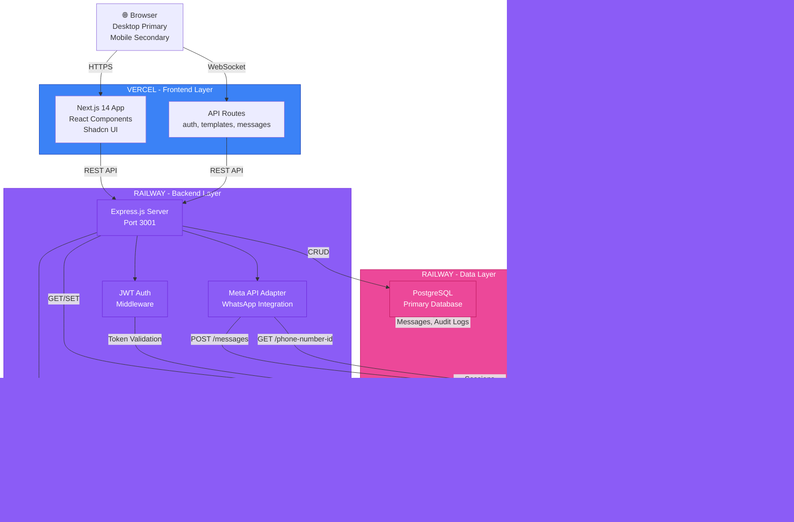
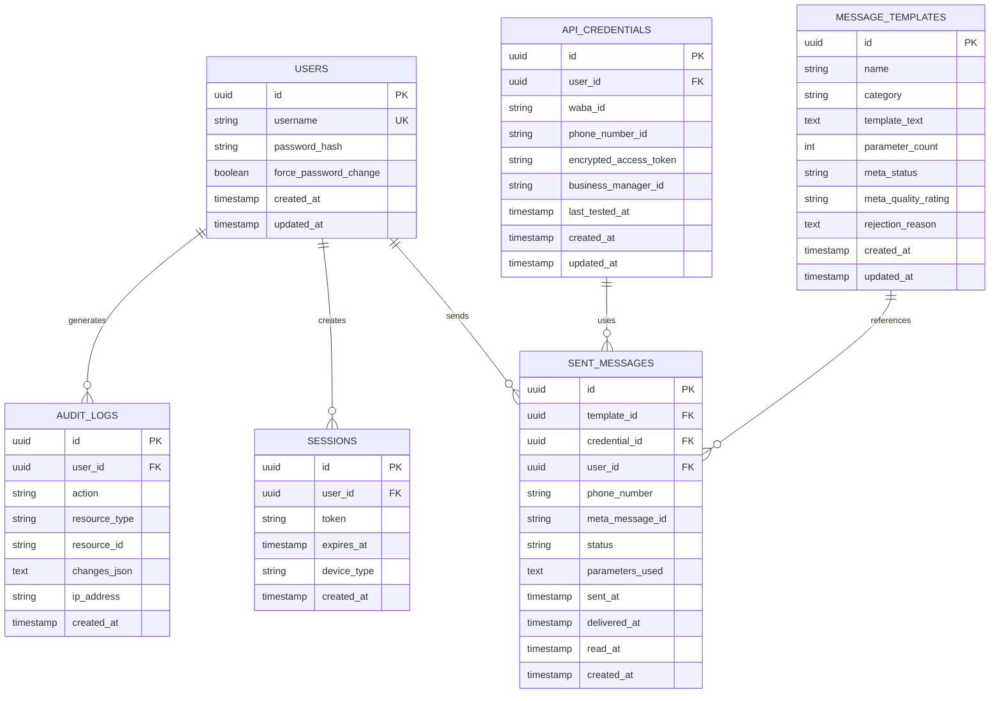

# Full Stack Architecture
## Meta WhatsApp Business API Platform - Cartão de Todos

**Document:** Architecture Design
**Version:** 1.0
**Date:** 2026-03-11
**Architect:** Aria (System Architect Agent)
**Status:** Final - Implementation Ready

---

## 1. Tech Stack Decisions

### 1.1 Frontend: Next.js 14 + React + Tailwind CSS + Shadcn UI

**Selection Rationale:**
Next.js 14 provides server-side rendering and API routes for seamless backend integration, ideal for non-developers requiring fast deployment. React enables component reusability and maintainability across the dashboard UI. Tailwind CSS ensures responsive design for desktop-primary usage pattern (secondary mobile checking). Shadcn UI provides accessibility-first Brazilian Portuguese component library reducing custom styling overhead.

**Key Capabilities:**
- Server-side rendering for SEO and performance
- Built-in API route support for reducing proxy complexity
- Image optimization and automatic code splitting
- Tailwind's utility-first approach for rapid UI development
- Shadcn components align with WCAG accessibility standards

---

### 1.2 Backend: Node.js + Express.js

**Selection Rationale:**
Node.js enables JavaScript full-stack development reducing team coordination and context switching. Express.js provides lightweight, battle-tested HTTP server with rich middleware ecosystem for authentication, logging, and error handling. Non-blocking I/O model suits WhatsApp API async message processing. Mature ecosystem ensures stability required for healthcare-adjacent operations (LGPD compliance).

**Key Capabilities:**
- Express middleware for JWT authentication and request validation
- Native async/await support for Meta API polling and webhooks
- Robust error handling and structured logging for compliance audits
- Hot reload capability during development for faster iteration

---

### 1.3 Database: PostgreSQL

**Selection Rationale:**
PostgreSQL provides ACID compliance for financial/healthcare adjacent transactional data (message sending, credential audit trails). JSON support handles Meta API response structures natively. Advanced constraints (unique, foreign keys) prevent data inconsistencies in template versioning. Proven track record with sensitive data protection meets LGPD requirements. Open-source reduces licensing costs (critical at R$118k budget).

**Key Capabilities:**
- ACID transactions for credential and message audit logs
- Role-based access control (RBAC) for multi-tenant franchise scenarios
- Full-text search for template library (1000+ templates)
- JSON columns for Meta webhook payloads and API responses

---

### 1.4 Cache: Redis

**Selection Rationale:**
Redis caches Meta API rate limit tracking (5000 requests/hour limit) to prevent expensive API calls. Session store for JWT-based authentication avoids database overhead. Template library caching reduces latency for "recent templates" feature. Distributed cache supports horizontal scaling as message volume increases post-MVP.

**Key Capabilities:**
- Atomic increment/decrement for rate limit tracking
- TTL-based session expiration (8-hour default, 30-day remember-me)
- ZSET data type for leaderboard-style message send counts
- Pub/Sub for real-time webhook delivery confirmations

---

### 1.5 Hosting: Vercel (Frontend) + Railway (Backend)

**Selection Rationale:**
Vercel provides Next.js native deployment with automatic branch previews for QA testing. Zero-config deployment reduces DevOps overhead critical at MVP stage. Railway offers PostgreSQL, Redis, and Node.js support in single dashboard eliminating multi-platform management. Both platforms provide Brazilian region options (São Paulo) for LGPD compliance. Predictable pricing (R$1k-3.4k/month) aligns with stated infrastructure budget.

**Key Capabilities:**
- Vercel: Automatic SSL/TLS, global CDN, 99.95% uptime SLA
- Railway: One-click database backups, environment variable management
- Both platforms: GitHub integration for automatic CI/CD deployment
- Vercel serverless functions reduce cold start issues vs traditional servers

---

## 2. System Design



**Data Flow Diagram:**

1. **User Action:** Admin clicks "Send Template"
2. **Frontend:** Next.js validates form, calls `/api/messages/send`
3. **API Route:** Validates JWT token, forwards to Express backend
4. **Authentication:** Express verifies JWT in Redis cache
5. **Meta Adapter:** Encrypts credentials from PostgreSQL, constructs Meta API request
6. **Meta API:** Processes message, returns message_id
7. **Database:** Logs sent_message record with timestamp and status
8. **Redis:** Updates rate limit counter (atomic increment)
9. **Response:** Returns success with message_id to frontend
10. **Webhook:** Meta sends delivery/read status → WebhookHandler updates PostgreSQL

---

## 3. Database Schema



**Schema Design Principles:**

- **UUID Primary Keys:** No sequential ID exposure for security
- **Soft Delete Pattern:** Add deleted_at column for compliance audit trails (LGPD right to be forgotten handled via anonymization)
- **Encrypted Storage:** access_token encrypted at application layer using AES-256, encryption key in environment variables
- **Denormalization:** meta_status and meta_quality_rating cached from Meta API (nightly sync job)
- **Audit Trail:** All CRUD operations on credentials and templates logged to AUDIT_LOGS
- **Indexes:** (user_id, created_at) for reporting, (meta_message_id) for webhook lookups, (username) for auth

---

## 4. API Endpoints

### Core Authentication

```
POST /api/auth/login
├─ Body: { username: string, password: string, remember_me?: boolean }
├─ Response: { token: JWT, expires_in: 28800, user: { id, username } }
└─ Status Codes: 200, 401 (invalid), 429 (rate limit), 423 (locked)

POST /api/auth/logout
├─ Headers: Authorization: Bearer {token}
├─ Response: { success: boolean }
└─ Status: 200, 401

POST /api/auth/change-password
├─ Body: { current_password: string, new_password: string }
├─ Response: { success: boolean }
└─ Status: 200, 401, 400 (validation)

GET /api/auth/me
├─ Headers: Authorization: Bearer {token}
├─ Response: { id, username, force_password_change: boolean }
└─ Status: 200, 401
```

### Settings & Credentials

```
GET /api/settings/credentials
├─ Headers: Authorization: Bearer {token}
├─ Response: { waba_id, phone_number_id, last_tested_at }
└─ Returns: Masked token (show last 4 chars), decrypts only on display

PUT /api/settings/credentials
├─ Body: { waba_id: string, phone_number_id: string, access_token: string }
├─ Response: { success: boolean, test_result?: { status: string } }
└─ Validation: Tests connection before saving

POST /api/settings/credentials/test
├─ Body: { waba_id, phone_number_id, access_token }
├─ Response: { connected: boolean, account_name: string, phone_numbers: array }
└─ Makes real GET request to Meta /v18.0/{phone_number_id} endpoint
```

### Message Templates

```
GET /api/templates
├─ Query: { search?: string, category?: string, skip?: number, limit?: 20 }
├─ Response: { templates: [], total: number, pages: number }
└─ Searches: template name, category, text content (PostgreSQL full-text)

POST /api/templates
├─ Body: { name, category, template_text, parameter_count }
├─ Response: { id, name, meta_status: 'PENDING' }
└─ Validation: Max 1024 characters, parameter count accuracy

GET /api/templates/:id
├─ Response: { id, name, category, template_text, meta_status, meta_quality_rating, rejection_reason }
└─ Includes: Meta API response fields for transparency

PUT /api/templates/:id
├─ Body: { name?, category?, template_text? }
├─ Response: { success: boolean, id }
└─ Resets meta_status to PENDING, requires resubmission to Meta

DELETE /api/templates/:id
├─ Response: { success: boolean }
└─ Soft delete: Sets deleted_at timestamp, retains history for audit
```

### Messages & Sending

```
POST /api/messages/send
├─ Body: { template_id: UUID, phone_number: string, parameters?: array }
├─ Response: { message_id: string, status: 'SENT', sent_at: ISO8601 }
├─ Rate Limit: 5000 req/hour (tracked in Redis)
└─ Validation: Phone format, parameter count match, credential existence

GET /api/messages
├─ Query: { status?: 'SENT|DELIVERED|READ|FAILED', skip?: 0, limit?: 20 }
├─ Response: { messages: [], total: number }
└─ Pagination: Cursor-based for consistency with Meta webhooks

GET /api/messages/:message_id
├─ Response: { id, template_id, phone_number, status, sent_at, delivered_at, read_at, failure_reason }
└─ Fields populated: sent_at (immediate), delivered_at (webhook), read_at (webhook)

POST /api/messages/webhook
├─ Header: X-Hub-Signature-256 (Meta HMAC verification)
├─ Body: Meta webhook payload (statuses, errors, etc.)
├─ Response: { success: boolean }
└─ Updates SENT_MESSAGES status, no response body sent to Meta
```

### Analytics & Reports

```
GET /api/analytics/overview
├─ Query: { date_from?: ISO8601, date_to?: ISO8601 }
├─ Response: { total_sent: number, delivered_count, read_count, failed_count, read_rate: % }
└─ Time range default: Last 30 days

GET /api/analytics/templates
├─ Response: { templates: [{ id, name, send_count, delivery_rate, quality_rating }] }
└─ Sorted: By send_count descending

GET /api/audit-logs
├─ Query: { resource_type?: string, action?: string, skip?: 0, limit?: 50 }
├─ Response: { logs: [{ timestamp, action, resource_type, user, ip_address, changes }] }
└─ Compliance: LGPD audit trail for credential updates and deletions
```

**Rate Limiting Strategy:**
- 5 login attempts / 15 minutes per IP
- 5000 messages / hour per user (Meta API limit)
- 100 API requests / minute per token (burst allowance for dashboard)

---

## 5. Security Architecture

### Authentication & Authorization

- **JWT Tokens:** HS256 algorithm, 8-hour expiration (900 seconds = 15 minutes short-lived, refresh at browser tab close), 30-day "remember me" extension
- **Password Requirements:** Minimum 8 characters, must include uppercase + lowercase + number + special character (!@#$%^&*)
- **Bcrypt Hashing:** Cost factor 10 (~100ms per hash on modern hardware), salt rounds 10
- **Session Management:** JWT stored in httpOnly, Secure cookies (prevents XSS token extraction)
- **Account Lockout:** 5 failed login attempts trigger 15-minute IP lockout (Redis counter with TTL)
- **Refresh Token:** Separate token in Redis for session extension without exposing long-lived JWT

### Data Encryption

- **At Rest:** AES-256-GCM encryption for Meta API credentials (access_token, WABA ID). Encryption key stored in environment variable (never committed). Decrypted only on form display (show/hide toggle).
- **In Transit:** TLS 1.3 for all network communication (Vercel/Railway enforce HTTPS). Meta API calls over HTTPS with certificate pinning (optional).
- **Database Level:** PostgreSQL encrypted columns plugin for additional encryption layer (optional Phase 2).

### API Security

- **CORS:** Restricted to Vercel deployment domain, no wildcard origins
- **CSRF Protection:** SameSite=Strict cookies, CSRF token validation on POST/PUT/DELETE
- **Input Validation:** All endpoints validate schema using Joi or Zod. Phone numbers validated against Brazilian format. Template text max 1024 chars. Parameter count enforced.
- **SQL Injection Prevention:** Parameterized queries (node-pg prepared statements). No string concatenation in queries.
- **Rate Limiting:** Redis-backed rate limiting. Implemented at API gateway level (Vercel limits, custom Express middleware).

### Compliance & Auditing

- **LGPD Compliance:**
  - Audit log captures all access to sensitive data (credentials, messages)
  - User consent tracking for message sending (implicit via form submission)
  - Data retention: 90-day default for sent_messages (configurable), permanent for audit_logs
  - Right to deletion: Soft delete with 30-day grace period, then permanent deletion
  - Data subject access: `/api/user/export` endpoint returns all user data in JSON (Phase 2)

- **Meta Compliance:**
  - Template quality rating validation before sending (prevents suspended templates)
  - Rate limit tracking prevents exceeding Meta's 5000 req/hour
  - Webhook signature verification (X-Hub-Signature-256) validates Meta-originated requests
  - Message parameter validation ensures compliance with template structure

- **Audit Logging:**
  - All credential updates logged with user, timestamp, IP address, old/new values
  - Template modifications tracked (who, when, what changed)
  - Message sends logged with phone number (hashed for privacy), template used, status
  - Failed API calls logged with error code for debugging and monitoring

### Infrastructure Security

- **Environment Variables:** Encryption key, JWT secret, database URL, Meta App Secret stored in Railway secure variables (never in code/git)
- **Database Access:** PostgreSQL restricted to Railway private network. No public internet exposure.
- **Redis Access:** Private Railway network, no authentication required (internal only)
- **Secrets Rotation:** Manual 90-day rotation scheduled (alerts in Sentry). Meta tokens rotated on credential change.
- **Dependency Scanning:** npm audit in CI pipeline. Snyk scanning for vulnerable packages (Phase 2).

---

## 6. Deployment Strategy

### CI/CD Pipeline (GitHub Actions)

**Trigger:** Push to main branch

```yaml
Workflow: deploy.yml
├─ Test Job:
│  ├─ npm ci
│  ├─ npm run lint
│  ├─ npm run typecheck
│  ├─ npm test
│  └─ Fail if any step fails
├─ Build Job (depends on Test):
│  ├─ npm run build
│  ├─ Generate bundle analysis report
│  └─ Fail on build errors
└─ Deploy Job (depends on Build):
   ├─ Frontend: Vercel deploy (automatic on main)
   └─ Backend: Railway deploy (automatic on main)
```

### Environment Management

**Development:**
- Local: `.env.local` (git-ignored)
- Database: Local PostgreSQL or Railway dev instance
- Redis: Local Redis or Railway dev instance
- Meta API: Sandbox (phone_number_id from Meta developer account)

**Staging:**
- Database: Staging PostgreSQL (data snapshot from production weekly)
- Redis: Staging Redis (shared with QA)
- Meta API: Sandbox (separate WABA ID for staging)
- Deployment: Manual via GitHub environment protection rules
- URL: `https://staging-cartao-todos.vercel.app`

**Production:**
- Database: Production PostgreSQL (encrypted backups, daily)
- Redis: Production Redis (replicated for high availability)
- Meta API: Production WABA ID (with rate limit monitoring)
- Deployment: Manual via GitHub environment (requires 2 approvals)
- URL: `https://cartao-todos.vercel.app` (TBD)
- Uptime SLA: 99.5% (monthly)

### Monitoring & Alerting

**Sentry Integration:**
- Error tracking for all unhandled exceptions
- Release tracking (deployed version)
- Performance monitoring (API response times, database query duration)
- Alerts: Critical errors (500s, security failures) trigger Slack notification

**Custom Metrics (Future - Phase 2):**
- Dashboard: Message send success rate, API response time p95/p99
- Alerts: Failed message rate > 2%, API latency > 5s, database connection pool exhaustion
- Retention: 30-day metric retention

**Health Checks:**
- `/health` endpoint returns: { status: 'healthy', uptime: seconds, database: 'connected', redis: 'connected' }
- Vercel health checks every 60 seconds
- Railway health checks every 30 seconds

### Backup & Disaster Recovery

- **Database:** PostgreSQL automated backups (daily) retained 30 days. Manual backups before production deployments.
- **Redis:** No backup required (sessions/cache only, reconstruct on restart)
- **Recovery Time Objective (RTO):** 4 hours (manual restoration from backup)
- **Recovery Point Objective (RPO):** 24 hours (daily backup)
- **Secrets Recovery:** Environment variables backed up in Railway secure vault (encrypted)

---

## 7. Technology Versions

**Frontend Stack:**
- Next.js: 14.x
- React: 18.x
- TypeScript: 5.x
- Tailwind CSS: 3.x
- Shadcn UI: Latest
- Axios: 1.x (HTTP client)

**Backend Stack:**
- Node.js: 20.x (LTS)
- Express.js: 4.x
- TypeScript: 5.x
- Joi: 17.x (validation)
- jsonwebtoken: 9.x (JWT)
- bcrypt: 5.x (password hashing)
- pg: 8.x (PostgreSQL driver)
- ioredis: 5.x (Redis client)
- axios: 1.x (HTTP requests to Meta)

**Database:**
- PostgreSQL: 15.x
- Redis: 7.x

**DevOps:**
- GitHub Actions (CI/CD)
- Vercel (Frontend hosting)
- Railway (Backend hosting + databases)
- Sentry (Error tracking)

---

## 8. Data Flow Examples

### Scenario 1: Send Message via Template

```
User Action:
1. Admin opens "Messages" → clicks "New Message"
2. Selects template from dropdown (cached in Redis)
3. Enters phone number (Brazilian format validation)
4. Clicks "Send"

System Flow:
1. Frontend: POST /api/messages/send { template_id, phone_number, parameters }
2. Next.js API Route: Validates schema, extracts JWT from cookie
3. Express Backend: Verifies JWT with Redis (token exists, not expired)
4. Authentication Middleware: Checks user_id in JWT, checks account_status
5. Message Service: Fetches encrypted credentials from PostgreSQL
6. Credential Manager: Decrypts access_token using AES-256
7. Rate Limit Check: Queries Redis counter for user, increments atomic counter
8. Meta API Call: POST https://graph.instagram.com/v18.0/{phone_number_id}/messages
   - Authorization: Bearer {access_token}
   - Body: { messaging_product, recipient_type, to, type, template }
9. Response: Meta returns { messages: [{ id: 'wamid.ABC123' }] }
10. Database Write: INSERT INTO sent_messages { id, message_id: 'wamid.ABC123', status: 'SENT', sent_at: NOW() }
11. Audit Log: INSERT INTO audit_logs { action: 'MESSAGE_SENT', user_id, template_id, timestamp, ip }
12. Response to Frontend: { message_id: 'wamid.ABC123', status: 'SENT', sent_at: ISO8601 }
13. Frontend: Display success notification with delivery timeline
```

### Scenario 2: Meta Webhook - Delivery Status Update

```
External Trigger:
Meta sends POST request to https://cartao-todos.vercel.app/api/messages/webhook
Headers: { X-Hub-Signature-256: sha256=XXXXXX }
Body: {
  entry: [{
    changes: [{
      value: {
        messages: [{
          id: 'wamid.ABC123',
          status: 'delivered',
          timestamp: 1699564321
        }]
      }
    }]
  }]
}

System Flow:
1. Vercel receives webhook, forwards to Express backend
2. Webhook Handler: Extracts X-Hub-Signature-256 header
3. Verification: Computes HMAC-SHA256(body, Meta_App_Secret) and compares
4. If invalid: Return 403 Forbidden (silently reject)
5. Parse body: Extract message_id ('wamid.ABC123') and status ('delivered')
6. Database Query: SELECT sent_messages WHERE meta_message_id = 'wamid.ABC123'
7. Update: UPDATE sent_messages SET status = 'delivered', delivered_at = timestamp
8. Audit: INSERT audit_logs { action: 'STATUS_UPDATE', resource_id: 'wamid.ABC123', status_change: 'SENT→DELIVERED' }
9. Response: HTTP 200 (empty body) - acknowledge to Meta
10. Optional: Emit WebSocket event to frontend for real-time update
```

---

## 9. Scalability Considerations (Phase 2+)

**Horizontal Scaling:**
- Frontend: Vercel auto-scales (serverless)
- Backend: Railway supports multi-replica deployments
- Database: PostgreSQL read replicas for reporting queries
- Redis: Cluster mode for session replication across regions

**Expected Growth:**
- MVP: 50 users, ~1000 messages/day
- 6 months: 200 users, ~10k messages/day
- 12 months: 500 users, ~50k messages/day
- Scaling targets: Database indexes, Redis TTL optimization, API caching headers

**Future Optimizations:**
- Message queue (Bull/RabbitMQ) for async template processing
- CDN for static assets (already via Vercel)
- Database connection pooling optimization
- WebSocket server for real-time notifications (Socket.io)

---

## 10. Risk Mitigation

| Risk | Probability | Impact | Mitigation |
|------|-------------|--------|-----------|
| Meta API rate limit hit | Medium | High | Redis counter tracking, user warnings at 80% quota |
| Credential compromise | Low | Critical | AES-256 encryption, audit logs, 90-day rotation |
| Template rejection by Meta | High | Medium | Pre-submission validation, quality rating display, guidance docs |
| LGPD violation | Low | Critical | Audit logging, data retention policies, encryption at rest |
| Database corruption | Low | Critical | Daily backups, point-in-time recovery, database replication |
| Service downtime > 1 hour | Low | High | 99.5% SLA via Vercel/Railway, health checks, alert system |

---

## 11. Success Criteria

- [ ] Platform achieves 99.5% uptime in first 30 days
- [ ] Zero security incidents reported
- [ ] 90% of admins can send first message in < 10 minutes
- [ ] Template approval rate > 90% (first-time pass)
- [ ] API response time p95 < 2 seconds
- [ ] No LGPD compliance violations in audits
- [ ] Zero unauthorized API access attempts
- [ ] Documented runbooks for all deployment/recovery scenarios

---

**Document Status:** Ready for implementation. Architecture approved for MVP Phase 1.

